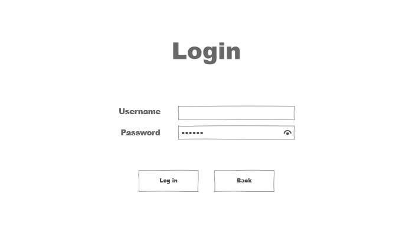
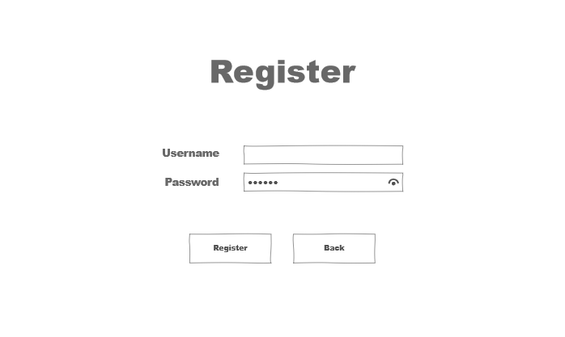
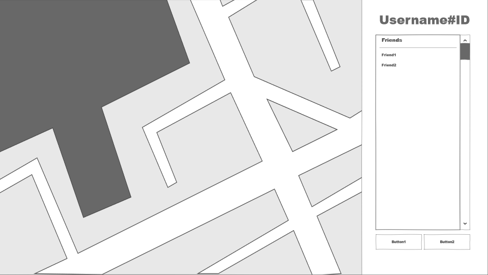

Отчёт по лабораторной работе № 3
---
##### Пара: 
    Иван - Евгений
##### Стиль:
    На равных
##### Вид деятельности:
    Проектирование внешнего вида приложения. Результат работы представлен в виде мокапов.
  

---
##### Пара: 
    Артём М. - Алексей
##### Стиль:
    Ведущий - ведомый
##### Вид деятельности:
    Стилистическое оформление внешнего вида приложения.      
--- 
##### Пара: 
    Артём К. - Алексей
##### Стиль:
    Штурман - водитель
##### Вид деятельности:
     Разработка интерфейса взаимодействия с интерактивной картой.
    
---
### Что понравилось: 
    - Напарник делится опытом
    - Снижение количества возможных ошибок
    - Улучшение качества кода
  
### Проблемы:
    - Зависимость от напарника
    - Увеличение времени разработки
    - Неуниверсальность подхода
---
### Выводы:
    Парное прграммирование имеет смысл применять только при правильном выборе методики для конкретной задачи.
