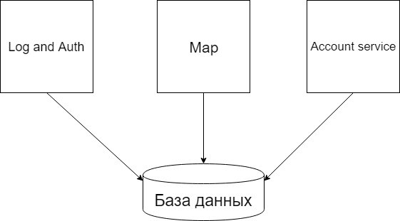

Отчёт по лабораторной работе № 4
---
# Проектирование архитектуры

##### 1. Тип приложения
Данное приложение является десктопным
##### 2. Стратегия развёртывания
Для развёртывания данного приложения необходимо иметь JDK8 и подключение к интернету.
##### 3. Используемые технологии
Для написания данного приложения был использован JavaFx в качестве фреймверка для создания десктопного приложения, так как он доступен с коробки, а в качестве управления базой данных выбрана MySQL из-за распространенности и быстроты действия.
##### 4. Показатели качества
- Низкие системые требования
- Мультиплаторменность
##### 5. Реализация сквозной функциональности
Для обработки ошибок, возникающих на уровне пакетов, реализованы отдельные контроллеры обработки ошибок, которые перехватывают пробрасываемые выше исключения и обрабатывают их.
##### 6. Диаграммы
Структурная схема

Диаграмма классов

 
# Анализ архитектуры
- Log and Auth - отвечает за идентификацию пользователя в системе
- Map - отображение и обновление информации, выводимой на карту
- Account service - отвечает за менеджмент аккаунтами: добавление, изменение списка друзей.  

# Сравнение и рефакторинг

Архитектуры As Is и To Be получились почти одинаковыми, исключениями являются добавление класса User, с помощью которого проще хранить и использовать информацию каждого пользователя приложения. 

На данный момент архитектура As Is, представленная структурной схемой, не имеет отличительных особенностей от архитектуры To Be, которая в свою очередь представлена диаграммой классов, поскольку она является простой и не имеет сложных связей и решений реализации. Также команда старается придерживаться изначальных решений, связанных с архитектурой.
